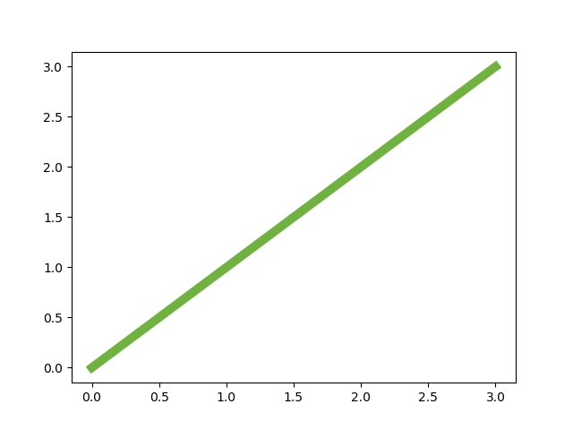

## Foreword

## The difference between Data Science, Machine Learning, Deep Learning and AI
A picture says more than a thousand words.


Data Science tries to answer one of the following questions:

* Classification -> “Is it A or B?”
* Clustering -> “Are there groups which belong together?”
* Regression -> “How will it develop in the future?”
* Association -> “What is happening very often together?”
## Statistics

### Mean, Median, Mode

#### Mean
    mean = sum(data) / len(data)
    
#### Median

#### Mode

#### Interquartile Range

### Distributions
#### Law of large numbers

### Discrete distributions

#### Binomial distribution

#### Poisson distribution
Poisson Process
* Events are independent of each other. The occurrence of one event does not affect the probability that another event will occur.
* The average rate (events per time period) is constant.
* Two events cannot occur at the same time.

### Continuous Distributions

#### Uniform Distribution

#### Exponential Distribution

#### The Normal Distribution

Diving deeper into data science I started to brush up my knowledge about math especially statistics.
The Mother of all Distributions


The normal distribution was formulated by Carl Friedrich Gauß in 18XX and can be implemented in Python like the following :

    def normal_distribution(x, mu=0, sigma=1):
        sqrt_two_pi = math.sqrt(2*math.pi)
        return math.exp(-(x-mu)**2 / 2 / sigma**2) / sqrt_two_pi * sigma

#### Binominal Distribution
#### Possion Distribution

### Bayes Theorem
Imagine that you come home from a party and you are stopped by the police. They ask you to take a drug test and you accept. 
The test result is positive. You are guilty.

But wait a minute! Is it really that simple?

In Germany about 2.8 million people consume weed on a regular basis, that’s about 3.5% of the population.

Let’s say D is drug addict and consumes weed regularly, ¬D consumes no weed. So the chance by randomly picking a person that he or she is a drug addict is P(D) = 0.035

Because You either take drugs or you don’t the remaining part must be non-drug takers P(¬D) = 1 – P(D) = 0.965.

The accuracy of a drug test is about 92%. So let’s assume that there are 8% false positives and 8% false negatives as well.

The chance that if a person actually takes drugs the test result will be positive is P(+|D) = 0.92 but You also get a positive reuslt when a person doesn’t take drugs in 8% of all cases: P(+|¬D) = 0.08 These are called “False positives”.

When a person doesn’t take drugs the test will be negative in 92% of all cases P(-|¬D) = 0.92.  And of course a test can also be negative even if a person takes drugs P(-|D) = 0.08. these are called “False negatives”. Got it?

What comes next?

#### Combined Probabilities

Knowing the success and error rates of the test and the relative distribution of drug consumers we can calculate the combined probabilities:

    P(+, D) = 0.035 * 0.92 = 0.0322
        Think: The test is positive AND the person is a drug user
    P(+, ¬D) = 0.965 * 0.08 = 0.0772
        Think: The test is positive AND the person is NOT a drug user
    P(-, D) = 0.035 * 0.08 = 0.0028
        Think: The test is negative AND the person is a drug user
    P(-, ¬D) = 0.965 * 0.92 = 0,8878
        Think: The test is negative AND the person is NOT a drug user

#### Bayes Theorem

    P(A|B) = P(B|A) * P(A) / P(B)

In our case we are interested in the probability of a person being a drug addict given the test is positive. That means:

    P(D | +) = P(+ | D) * P(D) / P(+) = P(+ | D) * P(D) / ( P(+, D) + P(+, ¬D) ) 
    = 0.92 * 0.035 / (0.0322 + 0.0772) = 0.294

The outcome is quite interesting and mildly shocking: 
The probability that a person tested positively is actually a drug addict is only around 29% or less than one third!

Why is this so counter intuitive, when the test states an accuracy of 92%?  That is the so called base rate fallacy. 
We have to take into account that only 3.5% of the population actually take drugs.

## Numpy
Numpy is a package for scientific computing in Python.


    import numpy as np


The most important data structure is ndarray, which is short for n-dimensional array.

You can convert a list to an numpy array with the array-method
```
my_list = [1, 2, 3, 4]
my_array = np.array(my_list)
```
You can also convert an array back to a list with
```
my_new_list = my_array.tolist()
```
You can retrieve the dimensionality of an array with the ndim property:
```
my_array.ndim
```
and get the number of data points with the shape property
```
my_array.shape
```

### Vector arithmetic
#### Addition / Subtraction
```
a = np.array([1, 2, 3, 4])
b = np.array([4, 3, 2, 1])
a + b
array([5, 5, 5, 5])
a - b
array([-3, -1,  1,  3])
```

#### Scalar Multiplication

```
a = np.array([1, 2, 3, 4])
a * 3
array([3,  6,  9, 12])
```

To see why it is charming to use numpy’s array for this operation You have to consider the alternative:

```
c = [1,2,3,4]
d = [x * 3 for x in c]
```

Dot Product

```
a = np.array([1,2,3,4]) 
b = np.array([4,3,2,1])

a.dot(b)
```
20 # 1*3 + 2*3 + 3*2 + 4*1

### linspace function

To create e.g. x-axis indices you can use the linspace function from numpy.
You give it a range (e.g. 0 to 10) and the number of divisions and it will distribute the values evenly across that range. The stop values is included in the resulting value array by default.

Example:
```python
import numpy as np
np.linspace(0, 10, num=9)

array([ 0. , 1.25, 2.5 , 3.75, 5. , 6.25, 7.5 , 8.75, 10. ]
```

## Matplotlib
matplotlib is the workhorse of data science visualization. The module pyplot gives us MATLAB like plots.

The most basic plot is done with the “plot”-function. It looks like this:


```python
import matplotlib.pyplot as plt
plt.plot([0, 1, 2, 3], [0, 1, 2, 3])
plt.show()
```
The plot function takes an x and y array and draws a blue line through all points.

Hint: When using JuPyter you can embed the images with the magic command
    
    %matplotlib inline

You can of course draw each point independently without a line:

```python
plt.plot([0, 1, 2, 3], [0, 1, 2, 3], "o")
```


or you can highlight the individual points while drawing the line

```python
plt.plot([0, 1, 2, 3], [0, 1, 2, 3], marker='o')
```
### Color of the plot

The color of the line can be changed with the color parameter. The default color of a plot is blue. If you want e.g. red as the color, you can use ‘r’.

```python
plt.plot([0, 1, 2, 3], [0, 1, 2, 3], color="r")
```


The following table shows the basic colors

| Color         | Shortcut      | 
| ------------- | ------------- | 
| blue          | b             |
| green         | g             |
| cyan          | c            |
| magenta       | m             |
| yellow        | y             |
| black         | k (not so obviuous)             |
| white         | w             |


In /matplotlib/_color_data.py you find additional colors, even colors from the XKCD color survey results

plt.plot(x, y, color="xkcd:nasty green")


### Stroke width and style

changing the width of the plotted line is done via linewidth

```
plt.plot([0, 1, 2, 3], [0, 1, 2, 3], linewidth=7.0, color="xkcd:nasty green")
```



and the stroke style can be altered with the linestyle parameter


    plt.plot([0, 1, 2, 3], [0, 1, 2, 3], linestyle=":", color="xkcd:nasty green", linewidth=7.0)


### Axis Labels

In school I learned that all axis of a plot must have labels. So let’s add them:

    plt.ylabel('some other numbers')
    plt.xlabel('some numbers')


### Saving the plot

If You want to save the plot as a png you can replace the show command with

    plt.savefig('scatter_01.png')

### Scatterplot

Here is another type of plot used in data science.

A very basic visualization is the scatter plot:

    import numpy as np
    import matplotlib.pyplot as plt
    
    N = 100
    x = np.random.rand(N)
    y = np.random.rand(N)
    
    plt.scatter(x, y)
    plt.show()


### Multiple Plots

You might have wondered how to draw more than one line or curve into on plot. I will show you now.

To make it a bit more interesting we generate two functions: sine and cosine. We generate our x-values with numpy’s linspace function

    import numpy as np
    import matplotlib.pyplot as plt
    
    x = np.linspace(0, 2*np.pi)
    
    sin = np.sin(x)
    cos = np.cos(x)
    
    plt.plot(x, sin, color='b')
    plt.plot(x, cos, color='r')
    plt.show()

You can plot two or more curves by repeatedly calling the plot method.


That’s fine as long as the individual plots share the same axis-description and values.

### Subplots

    fig = plt.figure()
    p1 = fig.add_subplot(2, 1, 1)
    p2 = fig.add_subplot(2, 1, 2)
    p1.plot(x, sin, c='b')
    p2.plot(x, cos, c='r'

The add_subplot method allows us to put many plots into one “parent” plot aka figure. 
The arguments are (number_of_rows, number_of_columns, place in the matrix) 
So in this example we have 2 rows in 1 column, sine is in first, cosine in second position:


when you have a 2 by 2 matrix it is counted from columns to row

    fig = plt.figure()
    p1 = fig.add_subplot(221)
    p2 = fig.add_subplot(222)
    p3 = fig.add_subplot(223)
    p4 = fig.add_subplot(224)
    p1.plot(x, sin, c='b')
    p2.plot(x, cos, c='r')
    p3.plot(x, -sin, c='g')
    p4.plot(x, -cos, c='y')


### Styles
    plt.style.available

### Bar Plots

    years = (2017, 2018, 2019)
    revenue = (5000, 7000, 9000)
    plt.bar(years, revenue, width=0.35)
    plt.xticks(years)
    plt.title("Revenue over years")


#### Stacked Bar
    years = (2017, 2018, 2019)
    revenue_customer_a = (2500, 2300, 2000)
    revenue_customer_b = (2500, 4700, 7000)
    width = 0.35       
    
    p1 = plt.bar(years, revenue_customer_a, width)
    p2 = plt.bar(years, revenue_customer_b, width, bottom=revenue_customer_a)
    
    plt.title('Revenue over years')
    plt.xticks(years)
    plt.legend((p1[0], p2[0]), ("Customer A", "Customer B"))
    


#### Horizontal Bar
    plt.barh(years, revenue)


#### Broken Bar
    fig, ax = plt.subplots()
    ax.broken_barh([(0, 120), (150, 10)], (10, 9))


    
    fig, ax = plt.subplots()
    ax.broken_barh([(0, 120), (150, 10)], (10, 9))
    ax.broken_barh([(0, 30), (150, 10)], (20, 9))
    ax.set_ylim(5, 35)
    ax.set_xlim(0, 200)
    ax.set_xlabel('seconds since start')
    ax.set_yticks([15, 25])
    ax.set_yticklabels(['Bill', 'Jim'])


### Pie Charts

    preferences = [30, 20, 25, 15]
    plt.pie(preferences)


To add the percentages into the chart you can use the attribute autopct

    plt.pie(preferences, autopct='%1.1f%%')


#### Adding Labels

    labels = 'Pizza', 'Hot Dogs', 'Tapas', 'Burger'
    preferences = [30, 20, 25, 15]
    plt.pie(preferences, labels=labels, autopct='%1.1f%%')
    
      

#### Adding Legend
    
    fig, ax = plt.subplots()
    
    ax.pie(preferences, autopct='%1.1f%%')
    
    ax.legend(labels,
              title="Favorite Foods",
              loc="center left",
              bbox_to_anchor=(1, 0, 0.5, 1))
              
              
            

     

## Pandas
Pandas is an akronym for "Python Data Analysis Library". Together with numpy and matplotlib it is part of the data science stack

You can install it via

    pip install pandas

For basic usage You import pandas as follows
    
     import pandas as pd 

### DataFrame

The basic data structure is the so called DataFrame.

    df = pd.DataFrame()


```
df = pd.DataFrame({'age': [28, 35, 23],
                   'weight': [72, 88, 62],
                   'city':['Manhattan', 'Baltimore', 'Louisville']
                  },
                  index=['Peter', 'Paul', 'Mary'])
```              

You cab get the column names via 
      
    df.columns
    
You can get an overview of the dataframe values with

    df.describe()
    
More information about the data frame 

    df.shape 
    df.dtypes 
    
You can access data from the dataframe via loc and iloc

    df.loc["Peter", 'age']

gives you 28

You can achieve the same outcome with

    df.iloc[0, 0]

the i in iloc stands for "index"

the colon is used as a wildcard for rows or columns
    
    df.loc[:, :]

#### Adding columns

    df.loc[:, 'new_column_name'] = new_column_data


### Working with real data

The data set we are using is the astronauts data set from kaggle:

Download Data Set NASA Astronauts from Kaggle

During this introduction we want to answer the following questions

* Which American astronaut has spent the most time in space?
* What university has produced the most astronauts?
* What subject did the most astronauts major in at college?
* Have most astronauts served in the military? What rank did they achieve?

Basic Usage

    import pandas as pd

    astronaut_data = pd.read_csv("./astronauts.csv")

With the len function You can get the number of rows in the dataset

    len(astronaut_data)

which gives us 357 astronauts

The columns property gives you the names of the individual columns

    astronaut_data.columns

The methods head() gives you the first five entries:

    astronaut_data.head()

whereas the tail method gives you the last n entries

    astronaut_data.tail(10)

With the iloc keyword You get the entries directly

    astronaut_data.iloc[0]

Which American astronaut has spent the most time in space?

    most_time_in_space = astronaut_data.sort_values(by="Space Flight (hr)", ascending=False).head(1)
    most_time_in_space[['Name', 'Space Flight (hr)']]

Sorting the dataframe can be done with sort_by_values. And for this question we sort for Space Flight (hr). Because we want the most hours we have to sort descending which translates to ascending=False.

head(1) gives us the correct answer:

Jeffrey N. Williams. He spent 12818 hours (534 days) in space.

Have You heard of him? Unsung hero!

Hint: the Dataset was updated the last time in 2017. As of 2019 Peggy Whitson is the american who has spent the most time in space. 
She has spend more than 665 days in space!

What university has produced the most astronauts?

The method value_counts is used to count the number of occurences of unique values

    astronaut_data['Alma Mater'].value_counts().head(1)

The US Naval Academy produced 12 astronauts
What subject did the most astronauts major in at college?

    astronaut_data['Undergraduate Major'].value_counts().head(1)

The same here: use value_counts method on the Undergraduate Major column.
The answer is Physics: 35 Astronauts studied physics in college
Have most astronauts served in the military?

the count method returns the number of entries which are not null or not NaN

    astronaut_data['Military Rank'].count()

In this case 207 astronauts have a military rank.

    astronaut_data['Military Rank'].value_counts().head(1)

which gives us 94 Colonels.

## Feature Scaling

What is Feature Scaling?

Feature Scaling is an important pre-processing step for some machine learning algorithms.

Imagine you have three friends of whom you know the individual weight and height.

You would like to deduce Christian’s  t-shirt size from David’s and Julia’s by looking at the height and weight.

| Name 	 | Height in m 	| Weight in kg 	| T-Shirt size |
| ------ | ------------ | ------------- | ------------ |
|Julia 	|1.58 |	52 |	Small|
|David |	1.79 	|79 	|Large
|Christian |	1.86 	|64 	|?

One way You could determine the shirt size is to just add up the weight and the height of each friend. You would get:

| Name 	| Height + weight 	| T-Shirt size |
| ------ | ------------ | ------------- |
| Julia |	53.58  |	Small|
| David |	80.79  | Large |
| Christian | 	65.86 |	

Because Christian’s height + weight number is nearer to Julia’s number than to David’s, Christian should wear a small T-Shirt. What?

### Feature Scaling Formula

    x’ = (x – xmin) / (xmax – xmin)

 
| Feature | 	min | 	max |
| ------ | ------------ | ------------- |
|Height |	1.58 |	1.86 |
|Weight |	52 	| 79 |

|Name | Scaled Height | Scaled Weight | Combined Scaled Height + Weight | T-Shirt size |
| ------ | ------------ | ------------- | ------------ | ------------- |
| Julia | 	0 |  	0 	| 0 |	Small
| David | 	0.75 | 	1 | 	1.75 |	Large |
| Christian | 	1  | 0.44 |	1.44 | 	?|

If we look at the combined scaled properties we see that Christian’s value now is closer to David’s so we deduce that Christian shall wear a large shirt as well.
Implementing feature scaling in python

As a little coding practice we can implement a feature scaling algorithm in Python:

    def feature_scaling(arr):
        ret_arr = []
        min_val = min(arr)
        max_val = max(arr)
        if min_val == max_val:
            raise ZeroDivisionError()
        for f in arr:
            f = (f - min_val) / float((max_val - min_val))
            ret_arr.append(f)
        return ret_arr

### MinMaxScaler from sklearn

Instead of writing our own feature scaler we can we should use the MinMaxScaler from sklearn. It works with numpy arrays by default.

    from sklearn.preprocessing import MinMaxScaler
    import numpy as np
    
    weights = np.array([[52.0], [79.0], [64.0]])
    scaler = MinMaxScaler()
    rescaled_weight = scaler.fit_transform(weights)
    print(rescaled_weight)

### Affected Algorithms

Which algorithms are affected by non-properly scaled features?

SVM and k-means are algorithms which are affected. SVM for example calculates distances and when two features differ dramatically in value range, the feature with the greater range will dominate the other. (As seen when adding kilograms and meters)

## Machine Learning

The Essence of Machine Learning

* A pattern exists
* The pattern cannot be described mathematically
* We have (enough) data on this problem


## The difference between supervised and unsupervised learning
Supervised Learning

You have training and test data with labels. 
Labels tell You to which e.g. class a certain data item belongs. 
Imagine you have images of pets and the labels are the name of the pets.

Unsupervised Learning

Your data doesn’t have labels. Your algorithm e.g. k-means clustering need to figure out a structure given only the data


### Support Vector Machines

### PCA

### Regression

#### Linear Regression → Vanilla Linear Regression

##### Derivation

The regression line can be described as follows:

ŷ<sub>t</sub> = &beta;<sub>0</sub> + &beta;<sub>1</sub>&sdot;x<sub>t</sub>

The error is the difference between the actual value and the value on the regression line:

&epsilon;<sub>t</sub> = y<sub>t</sub> - ŷ<sub>t</sub> = y<sub>t</sub> - (&beta;<sub>0</sub> + &beta;<sub>1</sub>&sdot;x<sub>t</sub>) = y<sub>t</sub> - &beta;<sub>0</sub>  &beta;<sub>1</sub>&sdot;x<sub>t</sub>

Because we cannot optimize every error individually we sum up all errors. Due to the fact that errors can be negative as well
we like to square the errors before summing them up.

&sum; &epsilon;<sub>t</sub><sup>2</sup> = &sum; (y<sub>t</sub> - &beta;<sub>0</sub>  &beta;<sub>1</sub>&sdot;x<sub>t</sub>)<sup>2</sup>

#### Lasso, Ridge, Elastic-Net Regression

### Decision Trees

## Clustering


## Classification


### Naive Bayes

    # training
    print("Start training")
    t0 = time()
    clf = GaussianNB()
    clf.fit(features_train, labels_train)
    print("training time:", round(time() - t0, 3), "s")
    
    # prediction
    print("start predicting")
    t0 = time()
    prediction = clf.predict(features_test)
    print("predict time:", round(time() - t0, 3), "s")
    
    # accuracy
    print("Calculating accuracy")
    accuracy = accuracy_score(labels_test, prediction)
    print("Accuracy calculated, and the accuracy is", accuracy)

Why is NB called naive?

### Quality
### Confusion Matrix
Let’s take the example

y_true = ["dog", "dog",     "non-dog", "non-dog", "dog", "dog"]
y_pred = ["dog", "non-dog", "dog",     "non-dog", "dog", "non-dog"]

When we look at the prediction we can count the correct and incorrect classifications:

    dog correctly classified as dog: 2 times (True Positive)
    non-dog incorrectly classified as dog: 1 time (False Positive)
    dog incorrectly classified as non-dog: 2 times (False Negative)
    non-dog correctly classified as non-dog: 1 time (True Negative)

When we visualize these results in a matrix we already have the confusion matrix:


#### sklearn

We can calculate the confusion matrix with sklearn in a very simple manner

    from sklearn.metrics import confusion_matrix
    print(confusion_matrix(y_true, y_pred, labels=["dog", "non-dog"]))

the output is:

    [[2 2]
    [1 1]]

which can be indeed confusing because the matrix is transposed. 
In contrast to our matrix from above the columns are the prediction and the rows are the actual values:


And that’s all – if you just have a binary classifier.
Multi-label classifier

So what happens, when your classifier can decide between three outcomes, say dog, cat and rabbit? (You can generate the test data with numpy random choice)

y_true = ['rabbit', 'dog', 'rabbit', 'cat', 'cat', 'cat', 'cat', 'dog', 'cat']
y_pred = ['rabbit', 'rabbit', 'dog', 'cat', 'dog', 'rabbit', 'dog', 'cat', 'dog']

cm = confusion_matrix(y_true, y_pred, labels=["dog", "rabbit", "cat"])

[[0 1 1]
[1 1 0]
[3 1 1]]

Precision and Recall

In the realms of Data Science you’ll encounter sooner or the later the terms “Precision” and “Recall”. But what do they mean?

Living together with little kids You very often run into classification issues:

My daughter really likes dogs, so seeing a dog is something positive. When she sees a normal dog e.g. a Labrador and proclaims: “Look, there is a dog!”

That’s a True Positive (TP)

If she now sees a fat cat and proclaims: “Look at the dog!” we call it a False Positive (FP), because her assumption of a positive outcome (a dog!) was false.

If I point at a small dog e.g. a Chihuahua and say “Look at the dog!” and she cries: “This is not a dog!” but indeed it is one, we call that a False negatives (FN)

And last but not least, if I show her a bird and we agree on the bird not being a dog we have a True Negative (TN)

This neat little matrix shows all of them in context:


If I show my daughter twenty pictures of cats and dogs (8 cat pictures and 12 dog pictures) and she identifies 10 as dogs but out of ten dogs there are actually 2 cats her precision is 8 / (8+2) = 4/5 or 80%.

    Precision = TP / (TP + FP)


Knowing that there are actually 12 dog pictures and she misses 4 (false negatives) her recall is 8 / (8+4) = 2/3 or roughly 67%

    Recall = TP / (TP + FN)


Which measure is more important?

It depends:

If you’re a dog lover it is better to have a high precision, when you are afraid of dogs say to avoid dogs, a higher recall is better 🙂


Different terms

Precision is also called Positive Predictive Value (PPV)

Recall often is also called

* True positive rate
* Sensitivity
* Probability of detection

Other interesting measures
Accuracy

    ACC = (TP + TN) / (TP + FP + TN + FN)


F1-Score

You can combine Precision and Recall to a measure called F1-Score. It is the harmonic mean of precision and recall

    F1 = 2 / (1 / Precision + 1 / Recall)

#### Scikit-Learn

scikit-learn being a one-stop-shop for data scientists does of course offer functions for calculating precision and recall:

    from sklearn.metrics import precision_score

    y_true = ["dog", "dog", "not-a-dog", "not-a-dog", "dog", "dog"]
    y_pred = ["dog", "not-a-dog", "dog", "not-a-dog", "dog", "not-a-dog"]

    print(precision_score(y_true, y_predicted , pos_label="dog"))

Let’s assume we trained a binary classifier which can tell us “dog” or “not-a-dog”

In this example the precision is 0.666 or ~67% because in two third of the cases the algorithm was right when it predicted a dog

    from sklearn.metrics import recall_score

    print(recall_score(y_true, y_pred, pos_label="dog"))

The recall was just 0.5 or 50% because out of 4 dogs it just identified 2  correctly as dogs.

    from sklearn.metrics import accuracy_score

    print(accuracy_score(y_true, y_pred))

The accuracy was also just 50% because out of 6 items it made only 3 correct predictions.

    from sklearn.metrics import f1_score

    print(f1_score(y_true, y_pred, pos_label="dog"))

The F1 score is 0.57 – just between 0.5 and 0.666.

#### ROC Curve

As we already introduced Precision and Recall  the ROC curve is another way of looking at the quality of classification algorithms.

ROC stands for Receiver Operating Characteristic

The ROC curve is created by plotting the true positive rate (TPR) on the y-axis against the false positive rate (FPR) on the x-axis at various threshold settings.

You already know the TPR as recall or sensitivity.


The false positive rate is defined as FPR = FP / (FP + TN)


##### Advantage

ROC curves have a big advantage: they are insensitive to changes in class distribution.
##### sklearn

    from sklearn.metrics import roc_curve

