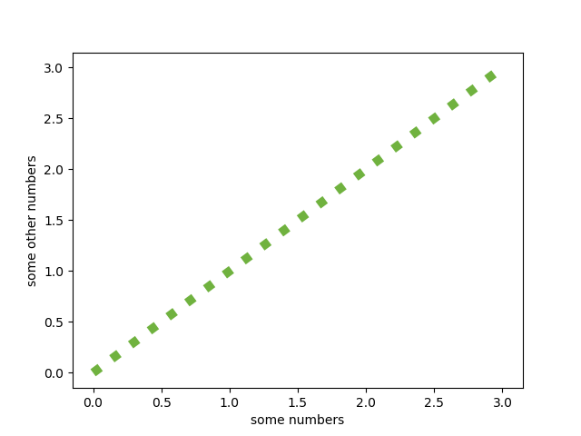

## Foreword

## The difference between Data Science, Machine Learning, Deep Learning and AI
A picture says more than a thousand words.


Data Science tries to answer one of the following questions:

* Classification -> “Is it A or B?”
* Clustering -> “Are there groups which belong together?”
* Regression -> “How will it develop in the future?”
* Association -> “What is happening very often together?”
## Statistics
### Bayes Theorem

## Numpy

## Matplotlib
matplotlib is the workhorse of data science visualization. The module pyplot gives us MATLAB like plots.

The most basic plot is done with the “plot”-function. It looks like this:


```python
import matplotlib.pyplot as plt
plt.plot([0, 1, 2, 3], [0, 1, 2, 3])
plt.show()
```
The plot function takes an x and y array and draws a blue line through all points.

You can of course draw each point independently without a line:

```python
plt.plot([0, 1, 2, 3], [0, 1, 2, 3], "o")
```


or you can highlight the individual points while drawing the line
```python
plt.plot([0, 1, 2, 3], [0, 1, 2, 3], marker='o')
```
### Color of the plot

The color of the line can be changed with the color parameter. The default color of a plot is blue. If you want e.g. red as the color, you can use ‘r’.

```python
plt.plot([0, 1, 2, 3], [0, 1, 2, 3], color="r")
```


The following table shows the basic colors

| Color         | Shortcut      | 
| ------------- | ------------- | 
| blue          | b             |
| green         | g             |
| cyan          | c            |
| magenta       | m             |
| yellow        | y             |
| black         | k (not so obviuous)             |
| white         | w             |


In /matplotlib/_color_data.py you find additional colors, even colors from the XKCD color survey results

plt.plot(x, y, color="xkcd:nasty green")


### Stroke width and style

changing the width of the plotted line is done via linewidth

plt.plot([0, 1, 2, 3], [0, 1, 2, 3], linewidth=7.0, color="xkcd:nasty green")


and the stroke style can be altered with the linestyle parameter

plt.plot([0, 1, 2, 3], [0, 1, 2, 3], linestyle=":", color="xkcd:nasty green", linewidth=7.0)


### Axis Labels

In school I learned that all axis of a plot must have labels. So let’s add them:

plt.ylabel('some other numbers')
plt.xlabel('some numbers')



### Saving the plot

If You want to save the plot as a png you can replace the show command with

plt.savefig('scatter_01.png')


## Pandas


## Machine Learning

The Essence of Machine Learning

* A pattern exists
* The pattern cannot be described mathematically
* We have (enough) data on this problem


## The difference between supervised and unsupervised learning
Supervised Learning

You have training and test data with labels. 
Labels tell You to which e.g. class a certain data item belongs. 
Imagine you have images of pets and the labels are the name of the pets.

Unsupervised Learning

Your data doesn’t have labels. Your algorithm e.g. k-means clustering need to figure out a structure given only the data

## scikit-learn